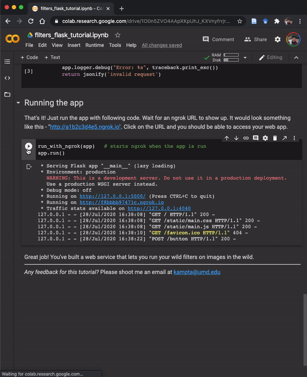

Starter code for building applications with AI
=========================================

## 1. Image Filters
A simple flask web app with REST API and some simple image filters. Checkout [simple_filters_in_action](https://github.com/kampta/AI4ALL/tree/master/simple_filters_in_action).

## 2. Image Classification

A simple flask web app with REST API and a pre-trained PyTorch model. Checkout [pytorch_classifier_in_action](https://github.com/kampta/AI4ALL/tree/master/pytorch_classifier_in_action).

