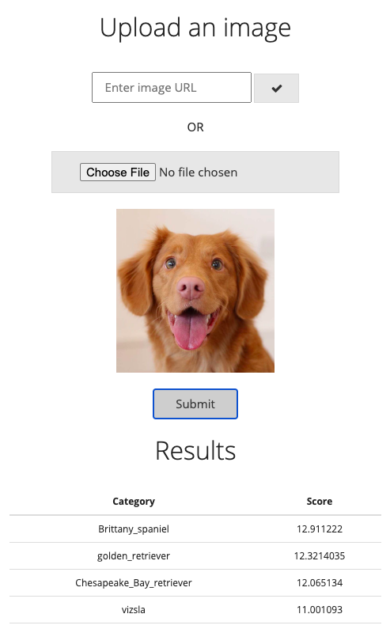

Building a photo tagging app with PyTorch
=========================================

A simple flask web app with REST API and a pre-trained PyTorch model



* [PyTorch](https://pytorch.org/) is a machine learning framework for research and development of ML models.
* [Flask](http://flask.pocoo.org/) is a micro web framework powered by Python.

## Prerequisites

The code has been tested with
* Flask==1.1
* requests==2.24
* Pillow==7.1
* torch==1.4
* torchvision=0.5

Install everything with `pip install -r requirements.txt`

## Getting started

(optional)
```
export FLASK_ENV=development
```

Run
```
FLASK_APP=app.py flask run
```

and open http://localhost:5000/demo in your browser